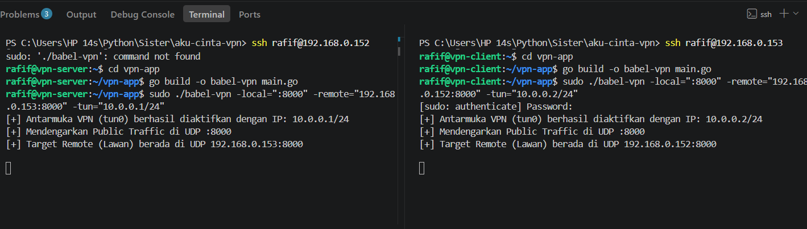
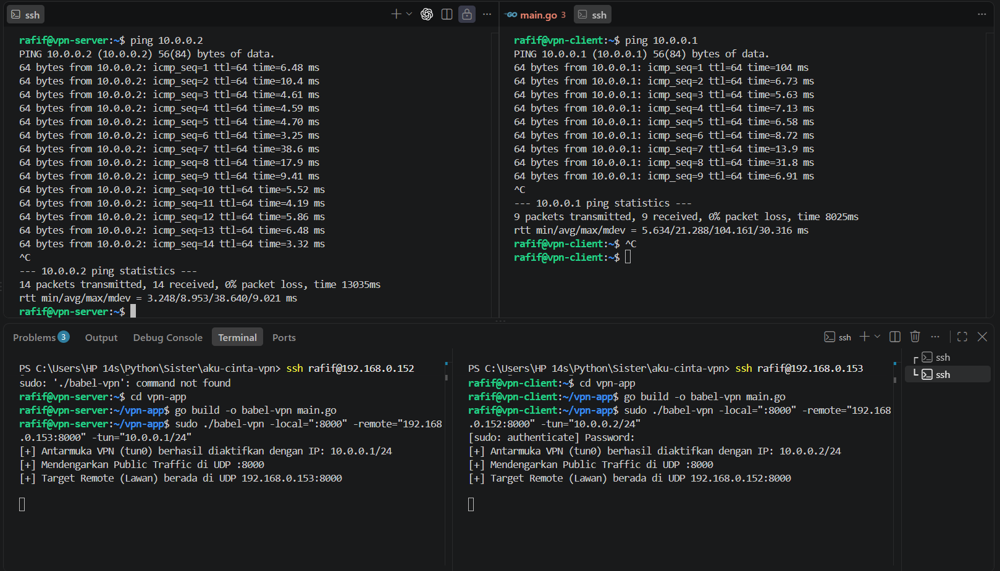
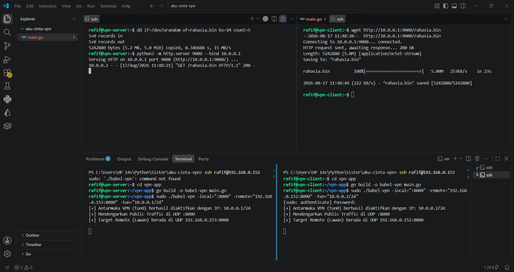

# Babel-VPN: Layer 3 Encrypted Tunnel 🚀

Babel-VPN adalah sebuah aplikasi Layer 3 Virtual Private Network (VPN) *Point-to-Point* yang dibangun dari nol (*from scratch*) menggunakan **Golang**. Aplikasi ini merutekan paket data (IP Packets) melalui antarmuka jaringan virtual (TUN), mengenkripsinya, dan mentransmisikannya secara aman melintasi jaringan publik/tidak terpercaya menggunakan protokol UDP.

Aplikasi ini dikembangkan sebagai pemenuhan spesifikasi rancangan arsitektur jaringan tingkat rendah (*low-level network architecture*) tanpa mengandalkan pustaka VPN pihak ketiga (seperti `libtins`, `scapy`, atau `OpenVPN`).

---

## 🛠️ Fitur Penting yang Diimplementasikan

1. **Raw System Call I/O (No High-Level Abstractions):**
   Program ini menginisialisasi *virtual network interface* (`tun0`) dengan berinteraksi langsung melalui Kernel Linux menggunakan instruksi `syscall.SYS_IOCTL`. Pembacaan dan penulisan lalu lintas asli (*native traffic*) dari dan ke dalam *kernel* dieksekusi murni via `syscall.Read` dan `syscall.Write`, menghindari *error 'not pollable'* pada *I/O multiplexer* bawaan bahasa tingkat tinggi.
2. **Concurrent Full-Duplex Tunneling:**
   Memanfaatkan **Goroutines** Golang untuk menciptakan dua *thread* pekerja asinkron. Satu pekerja (*worker*) bertugas membaca antarmuka `tun0` dan mengirimkannya ke internet, sementara pekerja lainnya siaga mendengarkan *socket* UDP dari internet untuk didekripsi dan disuntikkan kembali ke OS.
3. **Bypass Underlay Network Routing:**
   Kemampuan merutekan lalu lintas secara logis pada jaringan independen (misal: Subnet `10.0.0.x/24`) yang dienkapsulasi dan ditransmisikan melintasi *underlay network* (misal: IP fisik `192.168.0.x`).

---

## 🔐 Algoritma Kriptografi yang Dipilih

Aplikasi ini menggunakan algoritma **AES-256-GCM (Advanced Encryption Standard - Galois/Counter Mode)**. 

**Alasan Pemilihan:**
1. **Confidentiality (Kerahasiaan):** Menggunakan kunci rahasia 32-byte (256-bit) yang memblokir peretas dari membaca muatan *IP Packet* saat melintasi jaringan Wi-Fi publik (untrusted network).
2. **Integrity & Authenticity (Integritas):** Tidak seperti mode AES-CBC yang rentan terhadap modifikasi data, GCM menghasilkan *Message Authentication Code* (MAC). Jika ada pihak ketiga yang mencoba memodifikasi satu *bit* saja pada lalu lintas UDP (*packet tampering*), blok `gcm.Open()` akan langsung mendeteksinya, menghasilkan *error*, dan membuang paket tersebut sebelum menyentuh Kernel Linux.
3. **Performa Tinggi:** Mode GCM dirancang untuk komputasi paralel dan diakselerasi secara perangkat keras, membuatnya ideal untuk enkripsi *real-time* aliran *traffic* VPN Layer 3 tanpa menyebabkan *bottleneck* atau *latency* tinggi pada jaringan.

---

## 🚀 Cara Menjalankan Program

### 1. Kebutuhan Sistem (*Prerequisites*)
* 2 Mesin berbasis Linux (disimulasikan menggunakan Ubuntu Server pada mesin virtual).
* Akses `root` / `sudo` untuk membuat antarmuka jaringan virtual.
* *Compiler* Golang terinstal (`sudo apt install golang-go`).

### 2. Kompilasi (Lakukan di kedua mesin)
Jalankan perintah ini di dalam direktori *source code*:
```bash
go build -o babel-vpn main.go
```

### 3. Eksekusi VPN-Server
Jalankan perintah berikut pada terminal Mesin A (Server), sesuaikan -remote dengan IP mesin lawan:
```bash
sudo ./babel-vpn -local=":8000" -remote="192.168.0.153:8000" -tun="10.0.0.1/24"
```

### 4. Eksekusi VPN-Client
Jalankan perintah berikut pada terminal Mesin B (Client), menunjuk kembali ke IP Mesin A dengan IP virtual yang berbeda:
```bash
sudo ./babel-vpn -local=":8000" -remote="192.168.0.152:8000" -tun="10.0.0.2/24"
```

## 📸 Bukti Keberhasilan (Deliverables)
Berikut adalah bukti dokumentasi pengujian bahwa terowongan kriptografi berfungsi secara bidirectional tanpa modifikasi/kerusakan data (0% packet loss):

**VPN Menyala di 2 Endpoint Berbeda:** 


**Keberhasilan Ping ICMP Melalui Tunnel 10.0.0.x:** 


**Keberhasilan Transfer File > 2MB:** Terlampir tangkapan layar penggunaan wget dari Client yang sukses menarik file acak (rahasia.bin) berukuran 5MB dari Python HTTP Server milik Server melalui terowongan VPN rahasia tanpa putus. 


(Opsional: Tautkan link YouTube/Google Drive ke Video Demonstrasi penjelasan program di sini).